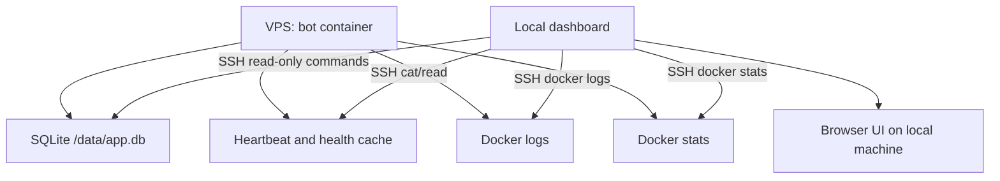

# Идеальный дашборд мониторинга бота

Документ описывает, что должно быть в отдельном дашборде для контроля работы бота во время пилота и после него. Это не инструкция по ручной эксплуатации, а целевая спецификация: какие показатели показывать, откуда их брать, какие пороги считать проблемой и какие действия оператор должен видеть.

Главная цель дашборда: быстро ответить на четыре вопроса.

1. Бот сейчас работает или пользователи уже видят проблему?
2. Где именно проблема: Telegram, Google Sheets, GigaChat, SQLite, VPS, polling, очереди?
3. Есть ли накопленные заявки, уведомления или обновления дашборда, которые не дошли?
4. Что безопасно сделать прямо сейчас: подождать retry, перезапустить контейнер, откатить релиз, почистить тестовые данные или разбирать вручную?

## Базовые принципы

Дашборд должен быть read-only по умолчанию. На пилоте нельзя давать кнопки, которые напрямую удаляют заявки, чистят очереди или перезапускают сервис без явного подтверждения и backup.

Дашборд не должен показывать секреты: Telegram token, credentials service account, private key, auth headers, полный raw response GigaChat, полный текст пользовательских заявок в технических логах. Для диагностики достаточно ID заявки, ID пачки, направления, статуса, короткого preview ошибки и времени.

Дашборд должен разделять техническое состояние и бизнес-состояние:

- техническое состояние: контейнер, healthcheck, память, диск, polling, очереди, внешние API;
- бизнес-состояние: сколько заявок создано, сколько срочных, сколько ожидают редактора, сколько готово, сколько массовых пачек открыто.

Для пилота важнее простая диагностическая полезность, чем красивый интерфейс. Первая версия может быть локальной страницей или Streamlit-приложением, которое читает данные через SSH/SQLite read-only и парсит логи.

## Главный экран

На первом экране должны быть крупные индикаторы:

| Блок | Норма | Предупреждение | Критично |
| --- | --- | --- | --- |
| Контейнер | `running`, `healthy`, restart count не растет | `health: starting` дольше 2-3 минут | `unhealthy`, `exited`, `restarting` |
| Heartbeat polling | свежее `STATUS_POLLING_HEARTBEAT_PATH` | старше 2 интервалов polling | старше `STATUS_POLLING_HEARTBEAT_MAX_AGE_SECONDS` |
| SQLite | `quick_check=ok` | медленные запросы, WAL растет | quick_check не `ok`, база не открывается |
| Telegram | health external успешен | один временный сбой после успеха | два подряд сбоя или нет первого успеха |
| Google Sheets | health external успешен | 429/500/timeout с retry | ошибки прав, схемы, обязательных spreadsheet ID |
| GigaChat | последние проверки успешны или fallback редкий | растет доля fallback | массово возвращает invalid JSON/schema |
| Notification outbox | нет `FAILED`, мало `PENDING` | `PENDING` старше 5-10 минут | есть `FAILED` или зависшие `SENDING` |
| Dashboard outbox | пустой или свежий `PENDING` | `PENDING` старше 10-15 минут | постоянные ошибки записи дашборда |
| RAM | стабильный RSS | ступенчатый рост без снижения | OOM, restart, swap растет постоянно |
| Диск | свободно больше 4 ГБ | занято 70-80% | занято больше 80-85% |

Главный экран должен показывать итоговый статус:

- `OK`: бот работает, очереди не копятся, внешние API доступны.
- `DEGRADED`: бот работает, но есть временные сбои, retry должен восстановить.
- `ACTION_REQUIRED`: нужна ручная проверка или перезапуск.
- `CRITICAL`: пользователи с высокой вероятностью не могут нормально заводить заявки.

## Верхняя строка статуса

В верхней строке:

- текущая версия `APP_VERSION`;
- uptime контейнера;
- время последнего restart;
- restart count;
- текущее состояние Docker health;
- время последнего успешного polling heartbeat;
- время последнего внешнего healthcheck;
- режим: production / loadtest / maintenance, если его можно определить по env или runbook.

Пример:

```text
APP_VERSION=pilot-20260617-0108
container=running healthy
uptime=14h 22m
restarts=0
last_polling_success=2026-06-18 10:41:23 MSK
external_health=ok, checked 3m ago
```

## Технические метрики VPS

### CPU и load average

Нужно показывать:

- CPU usage контейнера;
- load average за 1/5/15 минут;
- число CPU;
- есть ли постоянная загрузка выше возможностей VPS.

Для 1 CPU ориентиры:

- `load 0.0-0.7` нормально;
- `load 0.7-1.5` допустимо кратковременно;
- `load > 1.5` длительно означает очередь на CPU;
- `load > 3` для пилота уже повод смотреть логи и Google retry.

### RAM и swap

Нужно показывать:

- RSS контейнера;
- VMS контейнера;
- delta RSS за последние интервалы;
- системную RAM used/free;
- swap used/free;
- OOM events, если доступны.

Отдельно показывать график RSS по времени. Для текущего проекта это важно из-за Google API, Python heap и уже добавленных `gc + malloc_trim`.

Пороги:

- RSS стабилен или колеблется в пределах 100-200 МБ: нормально;
- RSS растет после каждой polling-итерации и не выходит на плато: warning;
- swap растет постоянно: warning/critical;
- контейнер рестартует из-за OOM: critical.

Источник:

- `docker stats --no-stream`;
- `/proc/self/status` внутри контейнера;
- строки логов `Status polling memory: iteration=... rss_mb=... vms_mb=... delta_rss_mb=...`.

### Диск

Нужно показывать:

- свободное место на VPS;
- размер Docker images;
- размер Docker volumes;
- размер `/opt/alfa-auto-requests`;
- размер backup-файлов;
- размер логов Docker;
- размер SQLite и WAL.

Пороги:

- свободно больше 4 ГБ: нормально;
- свободно 2-4 ГБ: warning;
- свободно меньше 2 ГБ или занято больше 85%: critical.

Важно: дашборд должен отдельно подсвечивать риск от старых `.tar` образов и backup-файлов, потому что они быстро занимают диск на VPS.

## Healthcheck

Нужно показывать результат `python -m app.health` по частям, а не только `ok/error`.

Блоки:

- heartbeat polling;
- SQLite quick_check;
- Telegram token configured;
- service account JSON exists and valid;
- обязательные spreadsheet ID заданы;
- Google spreadsheet доступен для каждого обязательного ID;
- dashboard spreadsheet доступен, если задан;
- Telegram `getMe` доступен;
- внешний health cache свежий.

Для каждой проверки:

- статус `OK/WARN/FAIL`;
- время последней попытки;
- время последнего успеха;
- число последовательных ошибок;
- безопасное короткое сообщение.

Источник:

- вывод `python -m app.health`;
- `/data/external-health.json`;
- `/data/status-polling-heartbeat.json`.

## Polling

Polling - центральный фоновый цикл. Он:

- доставляет накопленные Telegram уведомления;
- доставляет dashboard outbox;
- читает Google Sheets по одиночным заявкам;
- читает активные массовые пачки;
- периодически читает завершенные массовые пачки архивным проходом;
- обновляет tracking;
- ставит события в notification outbox;
- ставит проекции в dashboard outbox;
- пишет heartbeat после успешного цикла.

На дашборде нужно показывать:

- включен ли `STATUS_POLLING_ENABLED`;
- интервал `STATUS_POLLING_INTERVAL_SECONDS`;
- номер последней итерации;
- время последнего успешного цикла;
- количество подряд ошибок;
- длительность последнего цикла;
- p50/p95/max длительности за 1 час;
- сколько одиночных заявок проверено;
- сколько массовых пачек проверено;
- был ли full scan одиночных заявок;
- был ли архивный scan завершенных пачек;
- последние 10 ошибок polling.

Проблемные признаки:

- heartbeat stale;
- `consecutive_errors` растет;
- повторяющиеся `HttpError 400` по диапазону или схеме;
- постоянные `429 Quota exceeded`;
- polling стал дольше интервала и циклы накладываются по времени;
- after-success memory delta постоянно положительный.

## Очередь Telegram уведомлений

Таблица `notification_outbox` должна быть отдельным блоком.

Показывать:

- количество по state: `PENDING`, `SENDING`, `SENT`, `FAILED`;
- самый старый `PENDING`;
- самый старый `SENDING`;
- записи с `attempts >= 3`;
- записи с `attempts >= NOTIFICATION_MAX_ATTEMPTS`;
- количество событий по пользователям;
- среднее количество chunks на событие;
- последние ошибки доставки.

Критичные состояния:

- `FAILED > 0`;
- `SENDING` старше `NOTIFICATION_SENDING_STALE_SECONDS`;
- `PENDING` старше 10 минут при доступном Telegram;
- много chunks на одно событие, значит сообщение слишком длинное или группировка слишком крупная.

Минимальные SQL-метрики:

```sql
SELECT state, COUNT(*)
FROM notification_outbox
GROUP BY state;
```

```sql
SELECT state, COUNT(*), MIN(created_at), MAX(updated_at)
FROM notification_outbox
WHERE state IN ('PENDING', 'SENDING', 'FAILED')
GROUP BY state;
```

```sql
SELECT telegram_user_id, state, COUNT(*), MAX(attempts)
FROM notification_outbox
WHERE state != 'SENT'
GROUP BY telegram_user_id, state
ORDER BY COUNT(*) DESC;
```

## Очередь общего дашборда

Таблица `dashboard_outbox` показывает, что должно быть записано в общий Google dashboard.

Показывать:

- количество по state: `PENDING`, `SENDING`;
- количество по entity_type: `APPLICATION`, `BULK_BATCH`;
- самый старый `PENDING`;
- записи с большим числом attempts;
- последние ошибки;
- next retry time;
- сколько проекций coalesced за период.

Проблемные состояния:

- `PENDING` копится и не уменьшается;
- `SENDING` старше `DASHBOARD_OUTBOX_SENDING_STALE_SECONDS`;
- один и тот же `last_error` повторяется;
- ошибки `400` по схеме дашборда;
- ошибки прав service account;
- постоянные 500/timeout от Google.

SQL:

```sql
SELECT state, COUNT(*)
FROM dashboard_outbox
GROUP BY state;
```

```sql
SELECT entity_type, state, COUNT(*), MAX(attempts), MIN(updated_at)
FROM dashboard_outbox
GROUP BY entity_type, state;
```

```sql
SELECT entity_type, entity_id, state, attempts, next_attempt_at, last_error
FROM dashboard_outbox
ORDER BY updated_at DESC
LIMIT 20;
```

## Заявки

Блок заявок должен отвечать на вопрос: есть ли бизнес-проблемы, даже если технически контейнер healthy.

Показывать:

- создано одиночных заявок сегодня;
- создано срочных заявок сегодня;
- создано заявок по направлениям: `ФЛ`, `SME`, `АИ`, `VoiceBot/Collection`;
- распределение по статусам;
- сколько заявок ожидают редактора;
- сколько заявок получили итоговый ответ;
- сколько заявок в `polling_state='NOT_FOUND'`;
- сколько заявок имеют `not_found_count > 0`;
- сколько заявок не проверяются до будущего `next_status_check_at`;
- последние 20 заявок с ID, пользователем, направлением, статусом, строкой и временем.

SQL:

```sql
SELECT last_known_status, COUNT(*)
FROM submitted_applications
GROUP BY last_known_status
ORDER BY COUNT(*) DESC;
```

```sql
SELECT direction, COUNT(*)
FROM submitted_applications
GROUP BY direction
ORDER BY COUNT(*) DESC;
```

```sql
SELECT application_id, telegram_user_id, direction, sheet_name,
       last_seen_row_number, last_known_status, polling_state,
       not_found_count, next_status_check_at, updated_at
FROM submitted_applications
WHERE not_found_count > 0 OR polling_state != 'ACTIVE'
ORDER BY updated_at DESC
LIMIT 50;
```

Пороговые ориентиры:

- `not_found_count=1-3` может быть временным эффектом Google/диапазона;
- `not_found_count` растет у новых заявок, которые точно есть в таблице: нужен разбор polling;
- `NOT_FOUND` для массовых заявок после перехода пачки в `Готова` не должен появляться между архивными scan;
- много заявок без обновлений больше суток может быть нормой, но это нужно видеть отдельно от технических ошибок.

## Массовые пачки

Массовые заявки имеют отдельную логику, поэтому их нельзя смешивать с одиночными.

Показывать:

- активные незарегистрированные пачки;
- пачки в `BULK_CREATING`;
- пачки в регистрации;
- зарегистрированные пачки;
- пачки со stale `registration_started_at`;
- пачки по пользователям;
- `reserved_rows`, `data_start_row`, `data_end_row`, `registered_count`;
- последний известный статус пачки;
- время последнего обновления;
- есть ли поздние итоговые ответы после регистрации.

SQL:

```sql
SELECT registration_state, COUNT(*)
FROM bulk_batches
GROUP BY registration_state;
```

```sql
SELECT telegram_user_id, COUNT(*) AS unfinished_batches
FROM bulk_batches
WHERE registration_state != 'REGISTERED'
GROUP BY telegram_user_id
ORDER BY unfinished_batches DESC;
```

```sql
SELECT batch_id, telegram_user_id, direction, sheet_name,
       start_row, data_start_row, reserved_rows, data_end_row,
       registration_state, registered_count,
       last_known_batch_status, updated_at
FROM bulk_batches
ORDER BY updated_at DESC
LIMIT 50;
```

Проблемные признаки:

- пачка долго в `CREATING` или `BULK_CREATING`;
- регистрация началась, но не завершилась;
- пользователь имеет несколько незавершенных пачек;
- `registered_count=0` у пачки, которую пользователь считает заполненной;
- новая пачка попала в диапазон старой пачки;
- после регистрации нет dashboard projection.

## Создание массовых пачек

Таблица `bulk_creation_requests` нужна для идемпотентности.

Показывать:

- запросы по state: `AWAITING_DIRECTION`, `BULK_CREATING`, `CREATED`, `FAILED`;
- stale `BULK_CREATING` старше `BULK_CREATION_STALE_SECONDS`;
- last_error;
- batch_id и insert_url для диагностики.

SQL:

```sql
SELECT state, COUNT(*)
FROM bulk_creation_requests
GROUP BY state;
```

```sql
SELECT idempotency_key, telegram_user_id, direction, state,
       batch_id, last_error, started_at, updated_at
FROM bulk_creation_requests
WHERE state IN ('BULK_CREATING', 'FAILED')
ORDER BY updated_at DESC
LIMIT 50;
```

## Черновики и пользовательские workflow

Блок нужен, чтобы понимать, почему пользователь видит продолжение заявки, старые кнопки или зависший шаг.

Показывать:

- активные черновики;
- черновики по `current_step`;
- `submission_state`: `DRAFT`, `SUBMITTING`, `FAILED`, `SENT`;
- черновики старше N часов;
- pending_action в `user_settings`;
- active message id, если нужна диагностика устаревших кнопок.

SQL:

```sql
SELECT current_step, submission_state, COUNT(*)
FROM drafts
GROUP BY current_step, submission_state;
```

```sql
SELECT telegram_user_id, current_step, application_id,
       submission_state, updated_at
FROM drafts
ORDER BY updated_at DESC
LIMIT 50;
```

```sql
SELECT telegram_user_id, pending_action, active_chat_id,
       active_message_id, updated_at
FROM user_settings
WHERE pending_action IS NOT NULL
   OR active_message_id IS NOT NULL
ORDER BY updated_at DESC
LIMIT 50;
```

Важно: наличие черновика не является ошибкой. Ошибка - черновик в техническом состоянии `SUBMITTING` или pending action, который долго не меняется.

## Внешние API

### Telegram

Показывать:

- результат `getMe`;
- last success;
- consecutive failures;
- последние ошибки polling Telegram updates;
- количество неотправленных notification outbox.

Ошибки вида `Connection reset by peer` или `Request timeout error` обычно временные, если после них есть `Connection established`. Их нужно показывать как transient, а не critical.

### Google Sheets

Показывать:

- состояние обязательных spreadsheet ID;
- dashboard spreadsheet;
- количество 429 за последний час;
- количество 500/timeout/BrokenPipe за последний час;
- количество 400 по схеме/диапазону;
- последние operation_id из `app.google_api`.

Классификация:

- 429 quota/rate limit: пользовательские операции могут просить повторить через 2-3 минуты, фоновые outbox должны retry;
- 500/timeout/BrokenPipe: transient, retry обычно достаточен;
- 400 Unable to parse range/schema: ошибка кода или данных, ждать бесполезно;
- 403 permissions: ошибка прав service account, нужен ручной доступ.

### GigaChat

Показывать:

- количество проверок за период;
- доля успешных структурированных ответов;
- количество fallback;
- error_kind: `empty_response`, `invalid_json`, `schema_validation`, `transport_or_sdk_error`;
- retry success rate;
- последние безопасные preview ошибок.

Порог:

- одиночные ошибки GigaChat не должны ломать весь workflow;
- рост fallback выше 10-20% за короткий период - повод временно отключить строгую LLM-проверку или менять prompt/обработку.

## Логи и события

Дашборд должен иметь отдельную вкладку "Последние проблемы".

Группировать логи по категориям:

- `Traceback`;
- `Status polling iteration failed`;
- `Temporary Google API failure`;
- `Dashboard outbox delivery failed`;
- `GigaChat response validation failed`;
- `TelegramNetworkError`;
- `Could not disable previous active keyboard`;
- `Tracked application not found`;
- `unhealthy`;
- `OOM`/restart.

Для каждой группы:

- количество за 15 минут / 1 час / 24 часа;
- последний timestamp;
- пример безопасного сообщения;
- ссылка на инструкцию из `PILOT_OPERATIONS_GUIDE.md` или короткая рекомендация.

## Бизнес-вкладка "Пилот"

Для пилота на 5-15 человек нужен простой бизнес-обзор:

- активные пользователи сегодня;
- сколько пользователей завели хотя бы одну заявку;
- одиночные заявки сегодня;
- массовые пачки сегодня;
- строки в массовых пачках сегодня;
- срочные заявки сегодня;
- заявки с итоговым ответом;
- заявки без редактора;
- среднее время от создания до первого изменения статуса;
- среднее время до итогового ответа, если данные есть;
- топ направлений по количеству.

Важно: показывать это агрегированно, без раскрытия полного содержания заявок.

## Вкладка "Срочные"

Так как срочные заявки критичны для процесса, нужна отдельная вкладка:

- новые срочные заявки;
- срочные заявки без редактора;
- срочные заявки без итогового ответа;
- возраст каждой срочной заявки;
- ссылка на строку Google Sheets;
- направление;
- автор;
- текущий статус.

Порог:

- срочная заявка без движения больше заданного времени, например 30-60 минут, подсвечивается.

## Рекомендуемые виджеты первой версии

Для первой версии дашборда достаточно 12 блоков.

1. Общий статус: `OK/DEGRADED/ACTION_REQUIRED/CRITICAL`.
2. Контейнер: state, health, uptime, restarts.
3. VPS: CPU, RAM RSS, swap, disk.
4. Polling: heartbeat age, consecutive errors, last duration, memory RSS.
5. Telegram: external health, notification outbox states.
6. Google: external health, Google API errors by type.
7. GigaChat: checks/fallback/errors by kind.
8. Dashboard outbox: pending/sending/oldest/error.
9. Заявки: created today, by status, not_found.
10. Массовые пачки: active, creating, registering, registered, stale.
11. Срочные заявки: open urgent, no editor, no final answer.
12. Последние ошибки: grouped log events.

## Источники данных

### SQLite

Основной источник бизнес- и очередных метрик:

- `/data/app.db`;
- read-only подключение: `file:/data/app.db?mode=ro`;
- основные таблицы: `drafts`, `user_settings`, `submitted_applications`,
  `bulk_reservations`, `application_events`, `notification_outbox`,
  `dashboard_outbox`;
- legacy-таблицы, пока сохраняется совместимость: `bulk_batches`,
  `bulk_creation_requests`.

Для локального дашборда лучше не копировать базу каждую секунду. Достаточно:

- SSH-команда read-only раз в 10-30 секунд;
- или периодическое скачивание snapshot backup;
- или маленький read-only HTTP endpoint внутри контейнера в будущем.

### Файлы состояния

- `/data/status-polling-heartbeat.json`;
- `/data/external-health.json`;
- SQLite WAL-файлы.

### Docker и система

- `docker compose -f docker-compose.prod.yml ps`;
- `docker stats --no-stream`;
- `docker inspect`;
- `df -h`;
- `free -m`;
- `uptime`.

### Логи

- `docker compose -f docker-compose.prod.yml logs --since=... bot`;
- grep/парсинг по ключевым категориям.

Для первой версии можно парсить последние 1000-5000 строк. Для будущей версии лучше хранить агрегированные события в отдельной таблице или отправлять логи в легкий сборщик.

## Событийное хранилище `application_events`

`application_events` — журнал продуктовых событий, на котором строятся точные временные метрики и воронка движения заявки. Это отдельный слой от Docker-логов и очередей доставки. Запись события фиксирует факт изменения бизнес-состояния, а outbox отвечает за доставку внешнего действия.

Полный технический контракт таблицы, всех producer-событий и полей приведён в
[`APPLICATION_EVENTS_REFERENCE.md`](APPLICATION_EVENTS_REFERENCE.md). Этот раздел
описывает только использование событий dashboard.

### Схема таблицы

Таблица создаётся автоматически при инициализации SQLite:

```sql
CREATE TABLE application_events (
    id INTEGER PRIMARY KEY AUTOINCREMENT,
    application_id TEXT,
    telegram_user_id INTEGER,
    event_type TEXT NOT NULL,
    event_at TEXT NOT NULL,
    old_value TEXT,
    new_value TEXT,
    metadata_json TEXT,
    created_at TEXT NOT NULL
);
```

Индексы: `application_id, event_type, event_at` для истории заявки; `event_type, event_at` для агрегации по типу и периоду; `telegram_user_id, event_at` для пользовательских метрик.

### Поля и временные метки

| Поле | Назначение |
|---|---|
| `id` | Технический порядок записи. Не использовать как бизнес-время. |
| `application_id` | ID заявки. Для `draft_started` может быть ID черновика; для системного события допускается `NULL`. |
| `telegram_user_id` | Пользователь, связанный с событием. Для системных операций может быть `NULL`. |
| `event_type` | Стабильный код бизнес-события, используемый dashboard и SQL-агрегациями. |
| `event_at` | Время бизнес-события в ISO 8601 UTC с суффиксом `+00:00`. Используется для KPI. |
| `old_value` | Предыдущее значение состояния или поля. Для создания обычно `NULL`. |
| `new_value` | Новое значение, счётчик или диагностическая причина. |
| `metadata_json` | JSON-контекст: spreadsheet/sheet/row, направление, тип ответа, тип изменения, batch ID, пороги. Полные тексты заявок сюда не помещаются. |
| `created_at` | Время записи строки в SQLite. Обычно совпадает с `event_at`, но не заменяет его при расчёте длительности процесса. |

### События заявки

| Событие | Когда создаётся | Использование |
|---|---|---|
| `draft_started` | Пользователь начал создание заявки | активность и время от черновика до отправки |
| `application_submitted` | Заявка успешно записана в Google Sheets и tracking | число отправленных заявок, старт воронки |
| `application_indexed` | Заявка получила подтверждённые координаты в Sheets или изменила положение | этап «Появилась в Sheets», контроль индексации и перемещений |
| `status_changed` | Изменился статус в рабочей таблице | время до первого движения и история статусов |
| `editor_changed` | Назначен или изменён редактор | время до назначения и заявки без редактора |
| `editor_comment_added` | Стабильно появился комментарий редактора | факт обратной связи редактора |
| `scriptwriter_response_added` | Стабильно появился или изменился `Ответ сценариста` | факт ответа сценариста и время реакции |
| `final_answer_added` | Появился или изменился итоговый ответ редактора | время до финального ответа |
| `llm_check_completed` | Завершилась одна логическая проверка ADD/EDIT через GigaChat | first-pass rate, возвраты на уточнение, причины блокировки, длительность и технические ошибки |
| `llm_clarification_submitted` | Пользователь прислал ответ на запрос уточнения перед повторной проверкой | время ответа пользователя и число уточнений |
| `application_not_found` | Polling не нашёл заявку в ожидаемых листах | диагностика потерянных заявок; повторные записи не считать новыми заявками |
| `application_deletion_error` | Не удалось подтвердить или удалить строку по статусу `Удаление` | ошибки безопасного удаления |
| `application_deleted` | Строка удалена из Sheets и tracking очищен | контроль удалений и cleanup |

### Атомарность и повторяемость

События polling записываются в одной SQLite-транзакции с обновлением tracking и постановкой связанных notification/dashboard outbox-событий. `llm_check_completed` записывается в одной транзакции с обновлением результата проверки в черновике. Если транзакция не завершилась, соответствующее состояние и событие не считаются зафиксированными.

Неизменившееся значение при повторном polling не создаёт новый `status_changed`, `editor_changed` или `final_answer_added`. Для стабильных текстовых полей используется проверка одинакового значения в трёх polling-циклах; событие создаётся после третьего наблюдения. `application_not_found` может повторяться по одной заявке через интервал повторной проверки и не доказывает физическое удаление строки.

### События проверки GigaChat

Одна строка `llm_check_completed` соответствует одной логической проверке, а не каждой HTTP-попытке SDK. Событие создаётся только для первоначальной и повторной проверки одиночных ADD/EDIT. CHIPS, массовые заявки и автоматически создаваемая ADD/EDIT-строка после CHIPS не вызывают GigaChat и не создают эти события.

`new_value` принимает одно из значений:

- `passed` — описание прошло проверку;
- `needs_clarification` — требуется уточнение пользователя;
- `technical_fallback` — проверка не завершилась технически, пользовательский flow продолжился.

`metadata_json` имеет `schema_version=1` и содержит только технические признаки: `stage` (`initial` или `clarification`), `trigger` (`create` или `edit`), `prompt_version`, `prompt_hash`, `model`, `blocking_rule`, `duration_ms`, `response_attempts`, `validation_retries`, `error_kind`. `blocking_rule` допускает только `1.1`, `1.2`, `2.1`, `3.1` или `null`. `error_kind` нормализуется в `not_configured`, `timeout`, `network`, `auth`, `rate_limit`, `provider_error`, `empty_response`, `invalid_json`, `schema_validation`, `truncated_response`, `unknown`.

`prompt_hash` — первые 12 символов SHA-256 от исходных system/user шаблонов. Пользовательские значения в хеш не входят. Полные тексты заявки, промптов, ответа GigaChat, уточнения и инструкции пользователю в события не записываются.

`llm_clarification_submitted` содержит только `schema_version=1`, порядковый `clarification_number` и `trigger`. Время ответа пользователя рассчитывается между предыдущим `llm_check_completed` со значением `needs_clarification` и следующим `llm_clarification_submitted` той же заявки.

### Как dashboard читает события

Remote collector выбирает события за последние 30 дней и сортирует их по `event_at DESC, id DESC`. Dashboard группирует их по `application_id` и `event_type`.

- время берётся из `event_at`, а не из `created_at` и не из Docker-логов;
- `application_submitted` — начало жизненного цикла заявки;
- `application_indexed` — подтверждение появления в Sheets;
- первое событие из `editor_changed`, `status_changed`, `editor_comment_added`, `final_answer_added` используется для оценки начала работы редактора;
- `final_answer_added` используется как текущее окончание времени до финального
  ответа; `status_final_answer_ready` допускается только как исторический/внешний
  event type и production-код бота сейчас его не создаёт;
- если обязательного события нет, метрика помечается недоступной, а время из текущего состояния строки не подставляется;
- старые заявки до включения событийного журнала не получают события задним числом.

### Ограничения интерпретации

- Наличие строки в `submitted_applications` не гарантирует полный набор событий.
- `editor_comment_added` — текущий код комментария редактора; `user_comment_added` в production-коде не создаётся.
- `scriptwriter_response_added` относится к заполнению `Ответ сценариста` в Sheets, а не к произвольному сообщению в Telegram.
- События не являются аудитом полного содержимого заявки: полный текст хранится в Sheets.
- LLM-события начинают собираться только после выкладки; исторические проверки не восстанавливаются.
- Для first-pass rate используется самое раннее `llm_check_completed` с `stage=initial` и `trigger=create` по каждой заявке. Проверки после редактирования (`trigger=edit`) в этот показатель не включаются.
- Если путь сохранения координат не записал `application_indexed`, воронка «Появилась в Sheets» будет занижена и должна быть помечена как неполная.

### Контрольные SQL-запросы

```sql
SELECT event_type, COUNT(*), MIN(event_at), MAX(event_at)
FROM application_events
GROUP BY event_type
ORDER BY event_type;
```

```sql
SELECT application_id, event_type, event_at, old_value, new_value, metadata_json
FROM application_events
ORDER BY event_at DESC, id DESC
LIMIT 50;
```

Проверки выполняются read-only. Пустые `event_type`, `event_at` или некорректные `application_id` требуют отдельного расследования и не должны молча включаться в продуктовые KPI.

## Пороги для пилота

| Метрика | Warning | Critical |
| --- | --- | --- |
| Docker health | `starting` больше 3 минут | `unhealthy`, `exited`, `restarting` |
| Restart count | +1 за день | растет несколько раз за час |
| Heartbeat age | больше 2 интервалов polling | больше max age healthcheck |
| RSS | стабильный рост несколько часов | OOM/restart/swap растет |
| Disk used | больше 70-80% | больше 85% или меньше 2 ГБ |
| Notification `FAILED` | любое значение | растет или затрагивает нескольких пользователей |
| Dashboard `PENDING` | старше 15 минут | старше 1 часа или постоянная ошибка |
| Google 429 | несколько за час | массово мешает созданию заявок |
| Google 400 | любое повторение | ломает polling/workflow |
| GigaChat fallback | несколько единичных | больше 10-20% проверок |
| `not_found_count` | растет у отдельных заявок | массово растет у новых заявок |
| Stale bulk creating | старше 10 минут | пользователь не может продолжить workflow |

## Действия оператора

У каждого проблемного блока должна быть рекомендация:

- "Подождать retry": временные Telegram/Google 500/timeout/BrokenPipe, dashboard outbox не старый.
- "Проверить права/схему": Google 400/403, healthcheck по spreadsheet.
- "Перезапустить контейнер": heartbeat завис, но конфигурация и внешние API доступны.
- "Rollback": проблема появилась сразу после новой версии и ломает workflow.
- "Очистить тестовые данные": после loadtest или ручного теста перед пилотом.
- "Не трогать": активные черновики и открытые массовые пачки без признаков stale.

Дашборд может показывать команды из `PILOT_OPERATIONS_GUIDE.md`, но не должен выполнять опасные команды сам в первой версии.

## Минимальная реализация для локальной машины

Самый практичный вариант для пилота:

1. Локальный dashboard запускается на компьютере администратора.
2. Данные получает по SSH с VPS.
3. SQLite читает только read-only запросами.
4. Docker/system metrics получает shell-командами.
5. Логи читает через `docker compose logs --since`.
6. Ничего не пишет в production SQLite.

Плюсы:

- не нагружает VPS постоянным веб-сервером;
- не открывает наружу новый порт;
- не требует авторизации для внешнего dashboard;
- легко выключить.

Минусы:

- работает только когда открыт компьютер администратора;
- не заменяет alerting;
- качество зависит от SSH-доступа.

## Возможная архитектура



Для будущей версии можно добавить маленький endpoint `GET /internal/metrics`, но только если будет нормальная авторизация или доступ через SSH tunnel. Открывать dashboard публично на VPS без защиты нельзя.

## Что не нужно делать в первой версии

- Не подключать тяжелый Prometheus/Grafana на слабый VPS, если нет явной необходимости.
- Не делать публичную web-панель без авторизации.
- Не хранить полные тексты заявок в отдельной мониторинговой базе.
- Не добавлять кнопки "удалить заявку", "очистить очередь", "restart" без backup и подтверждения.
- Не считать `healthy` достаточным показателем: workflow может быть частично сломан при зеленом healthcheck.

## Приоритет разработки

### Этап 1: read-only MVP

- общий статус;
- Docker health;
- RSS/swap/disk;
- heartbeat age;
- notification outbox;
- dashboard outbox;
- заявки по статусам;
- массовые пачки;
- последние ошибки логов.

### Этап 2: бизнес-метрики пилота

- срочные заявки;
- заявки по направлениям;
- SLA по времени реакции;
- пользователи и активные workflow;
- графики за день.

### Этап 3: диагностика и подсказки

- классификация ошибок Google/Telegram/GigaChat;
- рекомендации "ждать/restart/rollback";
- ссылки на конкретные разделы эксплуатационного справочника;
- экспорт отчета за день пилота.

### Этап 4: безопасные действия

Только после стабильного MVP:

- read-only просмотр конкретной заявки;
- генерация SQL-команды для ручного удаления тестовой заявки;
- генерация backup-команды;
- подготовка rollback-команды;
- явное подтверждение перед любым write-action.

## Чек-лист готовности дашборда

- [ ] Не показывает секреты.
- [ ] Не делает write-запросы в SQLite.
- [ ] Не требует открывать новый публичный порт на VPS.
- [ ] Показывает `APP_VERSION`.
- [ ] Показывает Docker health и restart count.
- [ ] Показывает heartbeat age.
- [ ] Показывает RSS/swap/disk.
- [ ] Показывает `notification_outbox`.
- [ ] Показывает `dashboard_outbox`.
- [ ] Показывает заявки с `not_found_count`.
- [ ] Показывает незавершенные массовые пачки.
- [ ] Показывает последние ошибки по категориям.
- [ ] Имеет понятные пороги warning/critical.
- [ ] Подсказывает безопасное следующее действие.
